## 🔹 Project Description

This project implements a production-style hybrid identity architecture by integrating on-premises Active Directory Domain Services (AD DS) with Microsoft Entra ID using Microsoft Entra Connect Sync.

It establishes a **single, unified identity** across on-prem and cloud environments, incorporating advanced capabilities such as scoped synchronization, seamless Single Sign-On (SSO), Conditional Access, and writeback features.

---

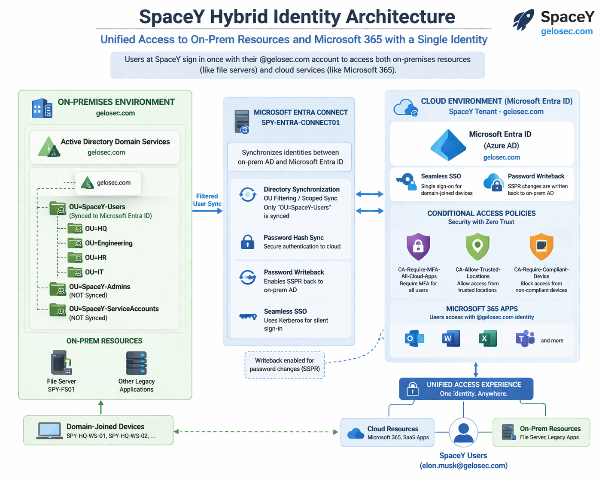

---
## 🔹 Core Capabilities

### Directory Synchronization
- On-prem AD users synchronized to Microsoft Entra ID  
- OU-based filtering for scoped identity sync

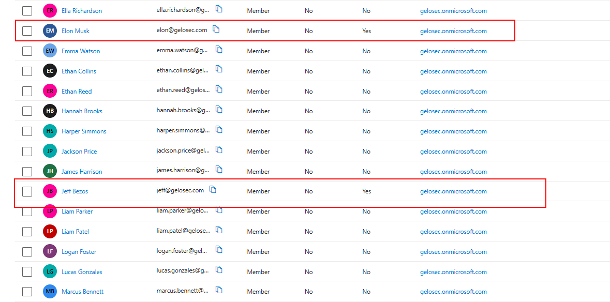

### Unified Identity Model
- Single identity across hybrid infrastructure  
- Consistent identity lifecycle (create, update, delete)  

### Seamless Single Sign-On (SSO)
- Automatic sign-in for domain-joined devices  
- Reduced authentication friction

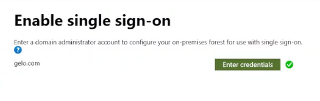

### Conditional Access
- Policy-based access control for cloud resources  
- Foundation for Zero Trust security  

### Writeback Features
- Password and Group writeback  
- Enables bidirectional identity management

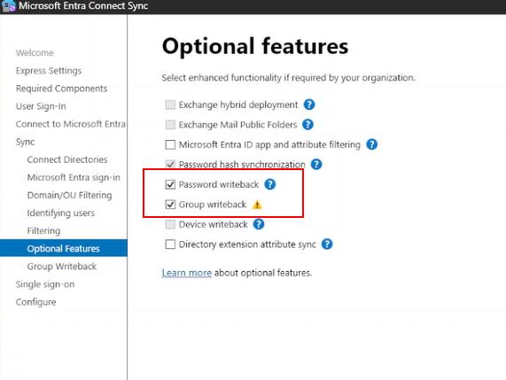

---

## 🔹 Architecture Components

- On-Premises Active Directory Domain Services (AD DS)  
- Microsoft Entra ID  
- Microsoft Entra Connect Sync  
- Domain-joined devices (for SSO)  
- Conditional Access policies  

---

## 🔹 Objective

To demonstrate how organizations can extend traditional identity systems into the cloud while enforcing security controls, minimizing user friction, and enabling hybrid access to applications.

This project highlights key identity design considerations, including synchronization scope, authentication experience, and access governance.

---

# Identity Authentication Methods (PHS, PTA, ADFS, Federation)

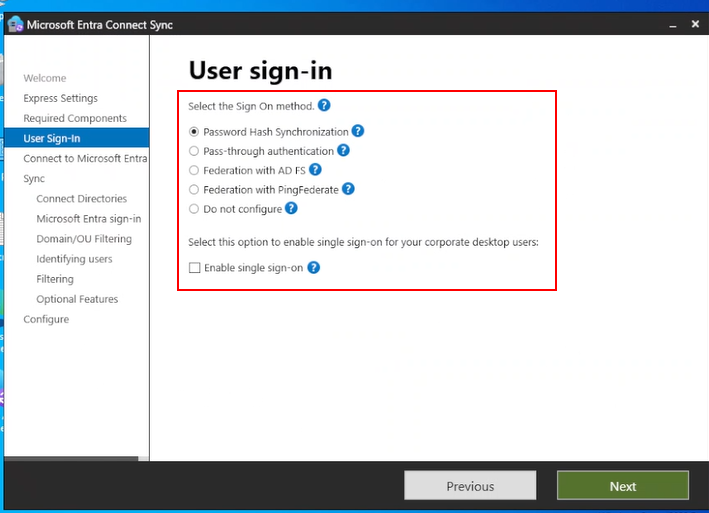

---

## Password Hash Synchronization (PHS)

Password Hash Synchronization (PHS) is a method that synchronizes password hashes from on-premises Active Directory to the cloud.

### What it does
- Allows users to use the **same credentials** for on-prem and cloud authentication
- Authentication happens **entirely in the cloud**
- Does **not require on-prem infrastructure during login**

### How it works
1. User password is hashed in Active Directory
2. That hash is **hashed again (re-hashed)**
3. The re-hashed value is synced to the cloud (e.g., Entra ID)
4. Authentication is performed in the cloud using the synced hash

> The cloud never sees or stores the actual password

### Advantages
- High availability (works even if on-prem is down)
- Simple architecture
- No dependency on on-prem infrastructure for authentication

---

## Pass-Through Authentication (PTA)

Pass-Through Authentication (PTA) validates user credentials directly against on-prem Active Directory in real time.

### What it does
- Ensures authentication is **always validated against on-prem AD**
- Enforces **real-time policies** (e.g., account lockout, logon restrictions)

### How it works
1. User attempts to log in to a cloud service
2. Request is securely sent to a **PTA agent** running on-prem
3. The agent validates credentials against Active Directory
4. Result is returned to the cloud

### Important Design Considerations
- **No credential cache in the cloud**
- Every authentication requires **live communication with on-prem AD**

### High Availability Requirements
- At least **2 Domain Controllers**
- At least **2 PTA agents on separate servers**
- Reliable network connectivity

### Failure Behavior
- If all PTA agents are down → authentication fails
- If AD is unreachable → authentication fails

---

## Active Directory Federation Services (ADFS)

Active Directory Federation Services (ADFS) is a federation service that provides authentication using **claims-based identity**.

### What it does
- Acts as an **Identity Provider (IdP)**
- Issues authentication **tokens** (SAML, OAuth)
- Enables **federated login** across systems

### How it works (Example: Microsoft 365)
1. User accesses an application (e.g., Microsoft 365)
2. User is redirected to ADFS
3. ADFS authenticates the user against Active Directory
4. ADFS issues a **token**
5. The application trusts the token and grants access

---

## Federation 

Federation is a trust relationship between systems.

> One system trusts another system to authenticate users on its behalf.

Instead of authenticating users directly, applications rely on a trusted identity provider.

---

## Federation with PingFederate

PingFederate is a federation server similar to ADFS but provided by Ping Identity.

### What it does
- Acts as an **Identity Provider (IdP)**
- Authenticates users via AD, LDAP, MFA, or other sources
- Issues tokens for applications

### How it works
1. User accesses an application
2. User is redirected to PingFederate
3. PingFederate authenticates the user
4. A token is issued
5. The application trusts the token

---

## Summary

| Method | Description |
|------|------------|
| **PHS** | Synchronizes password hashes to the cloud for cloud-based authentication |
| **PTA** | Authenticates against on-prem AD in real time via agents |
| **ADFS / PingFederate** | Uses federation and tokens to delegate authentication |

### To simplify:

- **PHS** → "Copy password hash to cloud"
- **PTA** → "Validate against on-prem every login"
- **ADFS / PingFederate** → "Authenticate once, issue token, and trust it"

---

## UPN and Entra ID Sign-In

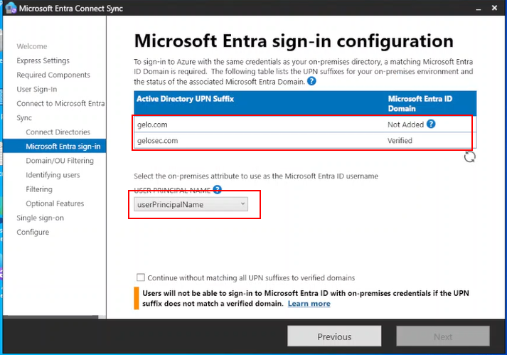

- `gelosec.com` is a verified domain in Entra ID  
  → Users can sign in to the cloud using this UPN

- `gelo.com` is not added or not verified  
  → Users cannot use this UPN for cloud sign-in  
  → Accounts can sync, but authentication will fail

## Key Principle

Only UPN suffixes that match **verified domains in Entra ID** can be used for cloud authentication.

## User Sign-In

The UPN that matches a verified Entra ID domain is used as the login identity in the cloud.

## userPrincipalName Attribute

`userPrincipalName` defines which Active Directory attribute is used as the username for cloud sign-in.

---
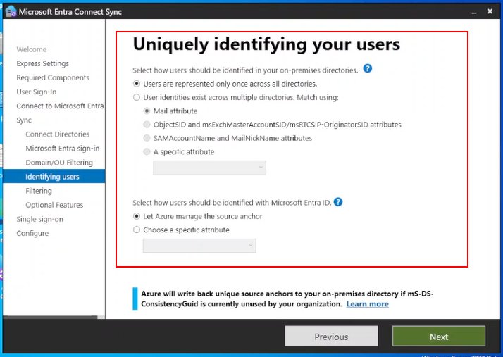

## Identity Matching and Source Anchor

### Users are represented once across all directories

- It just means each user exists only once in the environment. No duplicate identities across forests or directories.
- One AD user = one Entra ID User.

---

### Users exist across multiple directories

Used when the same user exists in multiple directories (e.g., multiple forests).

- Requires matching to merge identities into a single cloud user  

**Example:**
- User exists in Forest A and Forest B  
- Without matching → two separate cloud users  
- With matching → one unified identity  

---

## Source Anchor

The **source anchor** is the unique, immutable identifier that links an on-prem AD user to an Entra ID user.

- Ensures the same identity is maintained across syncs  
- Prevents duplicate or mismatched accounts  

### Immutable

Immutable means the value **must not change once set**.

- If it changes, Entra ID treats the user as a new identity  

---

### Let Azure manage the source anchor

- Entra ID automatically selects and manages a stable attribute  
- Recommended for most environments  
- Reduces risk of misconfiguration  

---

### Choose a specific attribute

- You manually define the attribute used as the source anchor  
- This attribute becomes the permanent identity key  

---

# Conditional Access

Conditional Access is a **policy engine** that controls access to applications and resources based on defined conditions.

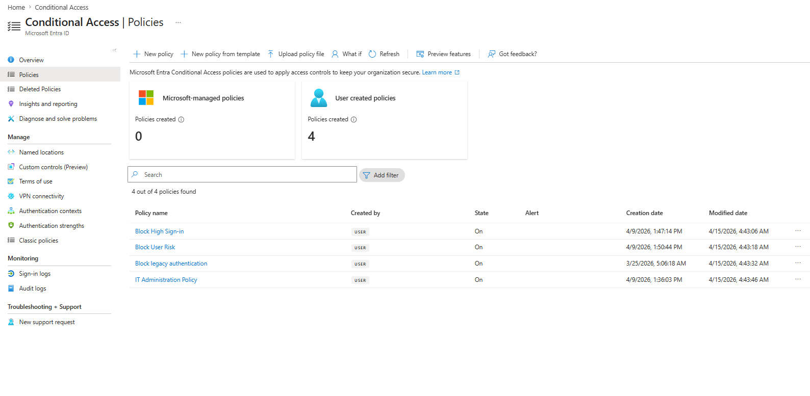

### Core Components

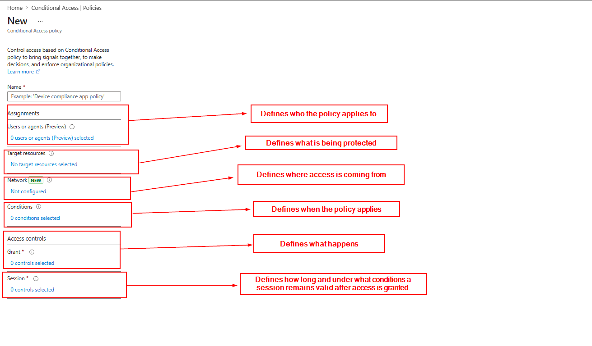

- **Users / Identities**  
  Defines *who* the policy applies to.  
  > Best practice: assign to **groups**, not individual users.

- **Target Resources (Cloud Apps)**  
  Defines *what* is being protected (e.g., M365, Azure, custom apps).

- **Network (Locations)**  
  Defines *where* access is coming from (IP ranges, countries, named locations).

- **Conditions**  
  Defines *when* the policy applies (risk, device platform, client app, location).

- **Access Controls**  
  Defines *what happens*:  
  - **Block** → deny access  
  - **Grant** → allow with requirements (MFA, compliant device, etc.)
 
- **Session Controls**  
  Defines *how long and under what conditions a session remains valid* after access is granted.

  - Controls session lifetime and persistence  
  - Can enforce reauthentication (e.g., require MFA again)  
  - Can limit or monitor session behavior (e.g., via Conditional Access App Control)

  > Focus is not just duration; it’s continuous enforcement after login.

---

## Named Locations

Named Locations are **reusable network definitions** used in Conditional Access.

> They provide signals, **they do not enforce access**.

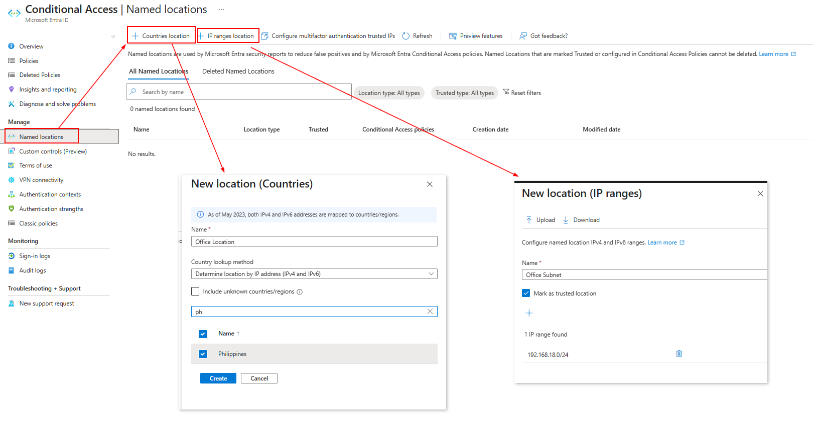

### Types

- **IP-Based Locations**  
  Static IP ranges that you define manually (can be marked as *Trusted*)

  Example: 192.168.7.0/26

- **Countries / Regions**  
Based on public IP geolocation

---

### Security Limitations

Location-based control is **weak on its own**:

- VPN spoofing (attacker appears from allowed country)
- Cloud-hosted attacks (VMs in trusted regions)

---

### Best Practice

Use Named Locations as **supporting signals only**, combined with:

- MFA
- Device compliance
- Sign-in / user risk

> If your security relies on IP or geography alone, it is bypassable.

---

## Key Takeaways

### What Problem This Solves

- **Multiple accounts / confusion** → One user = one identity for both on-prem and cloud  
- **Weak or inconsistent security** → Centralized control using Conditional Access  
- **Too many logins** → Seamless SSO reduces repeated sign-ins  
- **On-prem only setup** → Extended to cloud for modern apps and access  
- **Manual user management** → Automated sync and writeback  

---

### Lesson Learned

- **Hybrid identity connects old and new systems**  
  It lets on-prem Active Directory work with cloud services like Microsoft 365.

- **There are different ways users can log in**  
  Each method (PHS, PTA, Federation) has pros and cons, no one-size-fits-all.

- **Security should not rely on location alone**  
  IP address or country can be faked, don’t trust it blindly.

- **Conditional Access adds smart security**  
  It checks things like user, device, and risk before allowing access.

- **Login is not the end of security**  
  Sessions can still be controlled after login (e.g., require MFA again).

- **Keep it simple and layered**  
  Use multiple controls together (MFA, device checks, policies) instead of relying on just one.

- **Identity is the center of everything**  
  If identity is secure, access becomes easier to control.

---

## 📌 Project Breakdown

This project demonstrates a complete **Hybrid Identity implementation** using Azure AD, including identity synchronization and access control.

🎥 Watch the full walkthrough:

### Hybrid Identity Setup
[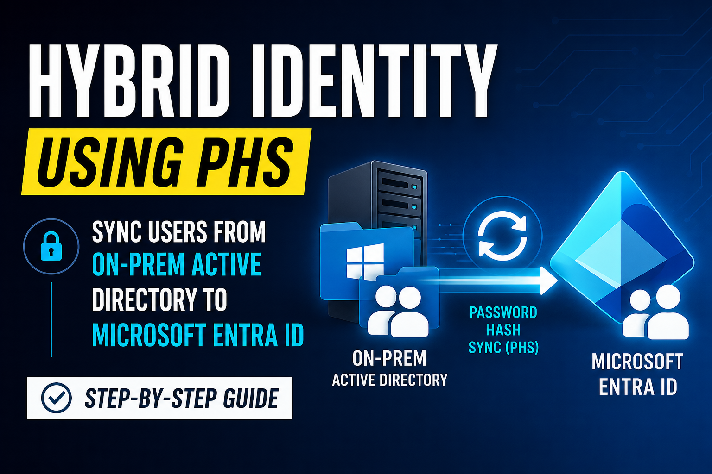](https://youtu.be/oD80HMzhOnU)

Covers:
- Azure AD Connect configuration
- Identity synchronization (on-prem → cloud)

---

### Conditional Access Policy in Hybrid Identity
[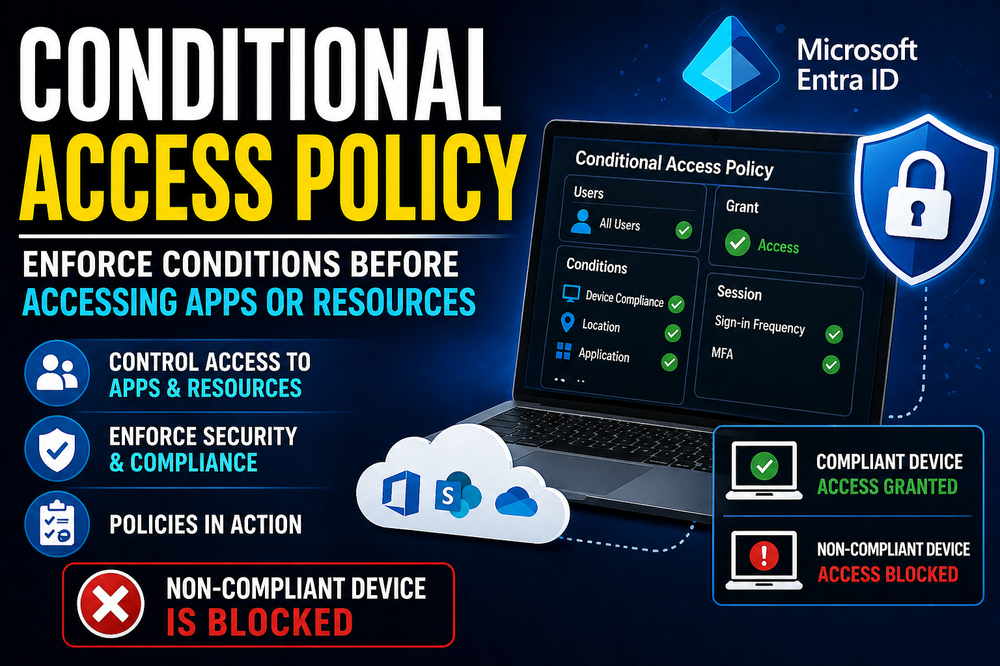](https://youtu.be/yKDtDiFSpNo)

Covers:
- Designing Conditional Access policies
- Enforcing MFA
- Risk-based access control

